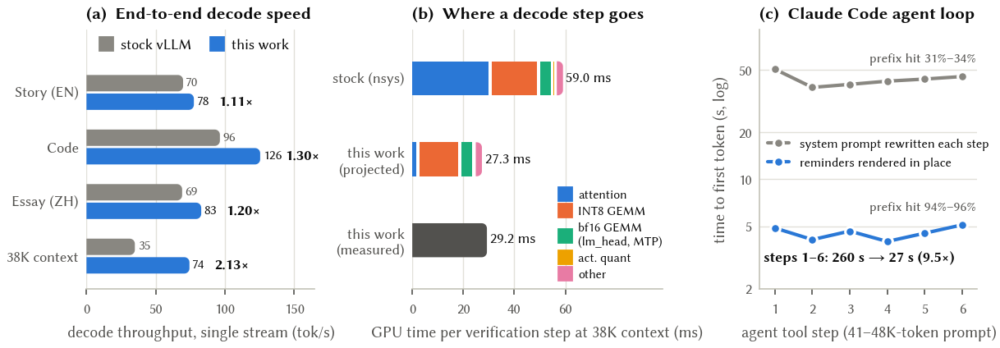

# qwen-a100-fastpath

Single-user, long-context serving of **Qwen3.8-27B (W8A8-INT8)** on one **NVIDIA A100 80GB**, behind an
Anthropic-compatible API for the Claude Code agent: the deployment, a vLLM plugin with three exact decode fast paths,
every benchmark, and the raw measurements behind the technical report.

**Report:** [`report/report.pdf`](report/report.pdf) (ACM SIGGRAPH / TOG format; LaTeX source in [`report/`](report)).



| | stock vLLM 0.31 | this work | |
|---|---:|---:|---:|
| Decode, English story | 69.8 tok/s | 77.6 tok/s | 1.11× |
| Decode, code | 96.4 tok/s | 125.5 tok/s | 1.30× |
| Decode, Chinese essay | 69.1 tok/s | 82.9 tok/s | 1.20× |
| Decode at 38K-token context | 35.0 tok/s | 74.4 tok/s | **2.13×** |
| One attention layer at 38K / 100K tokens | 1751 / 4590 µs | 126 / 294 µs | 13.9× / 15.6× |
| Claude Code agent loop, time to first token per tool step | ~44 s | ~4.6 s | 9.5× |

Single stream, GPU otherwise idle, MTP speculative decoding in both columns (stock: k=2; ours: k=4). Nothing that
changes what the model computes: no extra quantization, same context, distribution-exact speculative decoding.

## What is in here

| Path | Contents |
|---|---|
| `plugin/` | `qwen_fastpath`, a vLLM general plugin: split-KV GQA-packed attention for speculative verification, W8A16 decode GEMM over the W8A8 int8 weights, int8 MTP draft LM head. One switch each. |
| `server/` | Deployment: `install.sh` (uv + vLLM 0.31.0), `download.sh` (model, sha256-verified), `run_vllm.sh`, `env.sh`, `tuning.env`, `qwenctl` (systemd user unit), `auth/anthropic_auth.py` (x-api-key / bearer middleware), `chat_template_cc.jinja` (effort mapping + in-place system messages), `test_api.py`, `requirements.lock`. |
| `client/claude-qwen` | Launcher: runs Claude Code against the server through an SSH tunnel with a self-healing watchdog; sets model routing, context window, compaction and permission mode per process. |
| `bench/` | Kernel tests and microbenchmarks, end-to-end suites (decode, prefill, long context, Claude Code replay, agent-loop prefix cache, needle), Nsight Systems capture, the configuration-sweep runner. |
| `data/` | `measurements.json` (every number in the report, with provenance) and the raw sweep log. |
| `report/` | `main.tex`, `refs.bib`, `figures/make_figures.py` (renders all figures from `data/measurements.json`). |

## Deploy

On the GPU server (Linux, CUDA 13, A100), in the directory you want to serve from (`$QWEN_HOME`):

```bash
cp -r server/* $QWEN_HOME/ && cd $QWEN_HOME
./install.sh                                   # uv, Python 3.12, vLLM 0.31.0 into ./venv
venv/bin/pip install -e /path/to/repo/plugin   # or: bin/uv pip install --python venv/bin/python -e .../plugin
umask 077; mkdir -p hf && printf 'Authorization: Bearer %s\n' "<HF token>" > hf/.hdr   # model access
./download.sh && rm -f hf/.hdr                 # 31 GB, every file sha256-checked
printf 'QWEN_API_KEY=sk-local-%s\n' "$(openssl rand -hex 24)" > serve.env && chmod 600 serve.env
./qwenctl start                                # first start compiles for ~6-13 min; ./qwenctl status / logs
```

`tuning.env` selects the number of draft tokens, the drafting method and the three plugin switches
(`QWEN_FAST_ATTN`, `QWEN_FAST_LINEAR`, `QWEN_FAST_DRAFT_HEAD`); `run_vllm.sh` keys the compile cache on the plugin
source and switches, so a change recompiles instead of reusing stale graphs. The server listens on 127.0.0.1 only.

On the workstation:

```bash
install -m 755 client/claude-qwen ~/.local/bin/
mkdir -p ~/.config/claude-qwen && (umask 077; echo "<the QWEN_API_KEY value>" > ~/.config/claude-qwen/api_key)
export CLAUDE_QWEN_SSH_HOP=<ssh alias of the jump host or server> CLAUDE_QWEN_SSH_TARGET=<server alias on the jump host> \
       CLAUDE_QWEN_SERVER_DIR=$QWEN_HOME
claude-qwen                     # Claude Code on the local model; claude-qwen --help for server/tunnel commands
```

## Reproduce the measurements

```bash
. $QWEN_HOME/env.sh
python bench/test_spec_attn.py            # attention kernel: error vs fp32 and speed vs FlashAttention-2
python bench/test_w8a16.py                # W8A16 vs W8A8 error for every layer shape
python bench/kernels/linear_kernels.py    # CUTLASS / Triton / Marlin / bf16 GEMM microbenchmarks
QWEN_HOME=$QWEN_HOME python bench/bench2.py decode,prefill,long   # end-to-end suites against the running server
```

`bench/exp_series.sh` restarts the server with a given configuration and appends a full benchmark to
`bench/results.txt` (the log behind Table 4 is `data/experiment_log.txt`). The agent-loop experiments replay a
captured Claude Code session: capture one with `bench/agent/capproxy.py` (it records request bodies, which contain your
prompts and environment, so they are not part of this repository).

Figures: `.venv/bin/python report/figures/make_figures.py`; report: `cd report && tectonic main.tex`.

## Caveats

Measured on one A100 80GB PCIe with vLLM 0.31.0; the plugin patches internal vLLM APIs and pins that version. The
server was shared with other users' jobs; idle-GPU numbers come from windows without co-tenants, and co-tenancy costs
6.8-7.1× (report §8.1). No license file has been chosen yet.

---

## 中文摘要

在单张 A100 80GB 上为一个用户部署 Qwen3.8-27B（W8A8-INT8），对外提供 Anthropic 兼容接口，供 Claude Code 使用，并在**不改变模型计算结果**的前提下尽量提速。内容包括：

- **定位瓶颈**：在 38K 上下文下，投机解码的验证注意力（FlashAttention-2 变长路径）占了每步一半的时间。
- **验证注意力内核**：自研 split-KV + GQA 打包内核，在 38K 和 100K 上下文下分别快 13.9× 和 15.6×，有效带宽达到设备拷贝带宽的 83%。
- **解码矩阵乘**：直接复用 W8A8 的 int8 权重做 W8A16 解码，快 13–20%，数值误差降为原来的 1/5。
- **投机解码**：草稿用 int8 输出头，并改为概率采样草稿，接受长度提高 7–11%，输出分布严格不变。
- **前缀缓存**：修改聊天模板，让 Claude Code 每轮插入的 system 消息原位渲染，agent 循环的前缀命中率从 31–34% 提到 94–96%，每步首 token 延迟降低 9.5×。

**整体效果**：短上下文解码快 1.11–1.30×，38K 上下文快 2.13×。完整技术报告见 `report/report.pdf`。
